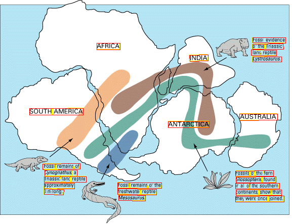
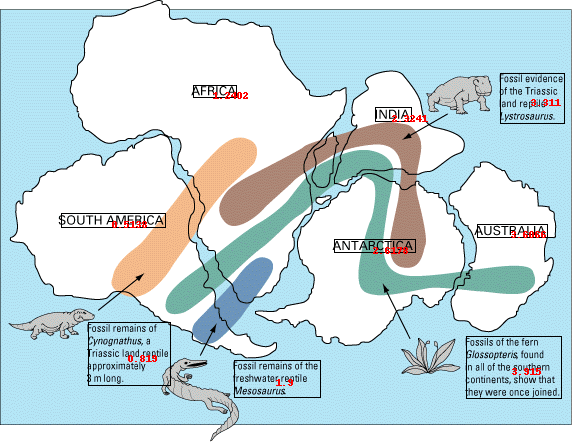

# Simple infographic


The above image is a simple infographic, containing blocks of Text and countries references well separated. You will see that some OCR engines will clearly expose their line processing while other would do a better raw output job. 
## Azure 
The below image represents the raw Azure OCR output where we drew each line of text bounding boxes. 


### Azure Raw Text ouput
The below output is not sorted in any just taken as-is from Azure Computer Vision response. 

```
Fossil evidence
AFRICA
of the Triassic
land reptile
INDIA
Lystrosaurus.
SOUTH AMERICA
AUSTRALIA
ANTARCTICA
Fossil remains of
Cynognathus, a
Fossils of the fern
Triassic land reptile
Glossopteris found
approximately
Fossil remains of the
in all of the southern
3 m long.
freshwater reptile
continents, show that
Mesosaurus
they were once joined.
```
We can clearly see that the lines of text are processed in a certain order in Azure Computer Vision adding the noise of the continents in between "sentences".
Sorting on the Y axis ascending will probably give the same result as the raw output. So our goal is to rebuild the logical stream of text. 

### Azure BBoxing... 
Boxes are drawn on the original image. The numbers in red reprensent the blockid we use to sort the final boxes. See our [sorting](/sorting) section for more details. 

#### Azure BBoxing text output
```
SOUTH AMERICA
Fossil remains of Cynognathus, a Triassic land reptile approximately 3 m long.
AFRICA
Fossil remains of the freshwater reptile Mesosaurus
INDIA
ANTARCTICA
Fossil evidence of the Triassic land reptile Lystrosaurus.
AUSTRALIA
Fossils of the fern Glossopteris found in all of the southern continents, show that they were once joined.
```
Here we do have a more concise output, clearly isolating the countries references and explanations of this infographic. We see the influence of an X axis sorting. 

Let's check on the same example with Google OCR engine... 

## Google 
The below image represents the raw Google OCR output where we drew each line of text bounding boxes. Yellow colored are the words, red is for paragraphs and blue are for the blocks. See [Google Ocr](/google) for more details.

### Google Raw Text output (block level)
```
AFRICA
Fossil evidence
of the Triassic
land reptile
Lystrosaurus
INDIA
SOUTH AMERICA
AUSTRALIA
ANTARCTICA
Fossil remains of
Cynognathus, a
Triassic land reptile
approximately
3 m long
Fossil remains of the
freshwater reptile
Mesosaurus
Fossils of the fern
Glossopteris found
in all of the southem
continents, show that
they were once joined.
```

### Google BBoxing 
Boxes are drawn on the original image. The numbers in red reprensent the blockid we use to sort the final boxes. See our [sorting](/sorting) section for more details. 

#### Google BBoxing text output
```
SOUTH AMERICA
Fossil remains of Cynognathus, a Triassic land reptile approximately 3 m long
AFRICA
Fossil remains of the freshwater reptile Mesosaurus
INDIA
ANTARCTICA
Fossil evidence of the Triassic land reptile Lystrosaurus
AUSTRALIA
Fossils of the fern Glossopteris found in all of the southem continents, show that they were once joined.
```
## Conclusion

With this simple example we can see that both outputs are more aligned hence you can proceed with your next text transformation (i.e. Translatione etc.)

