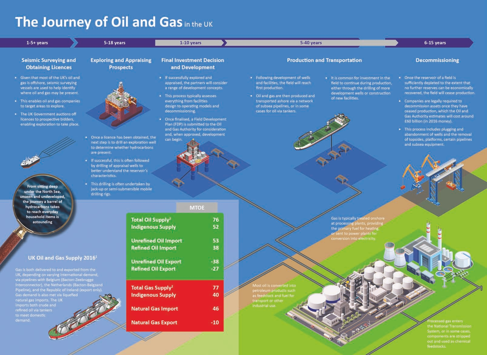
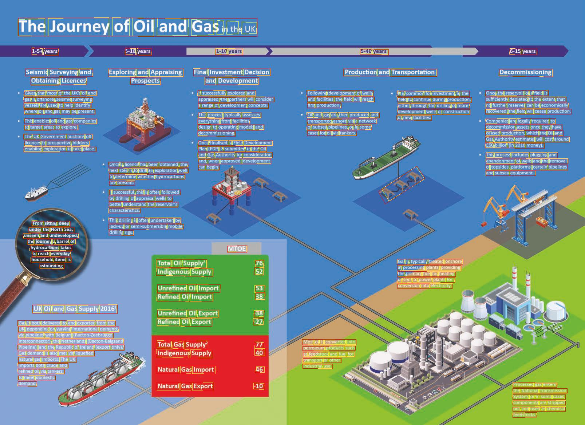
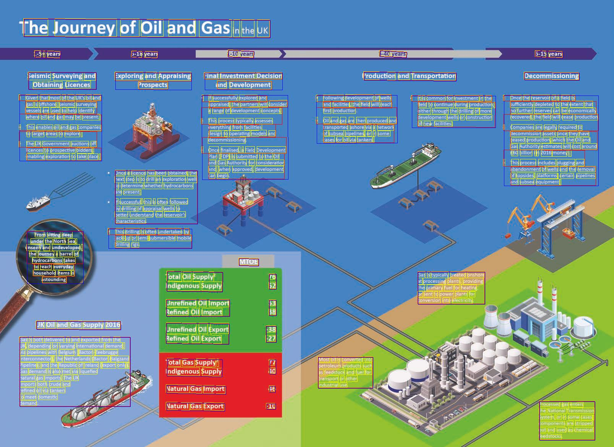
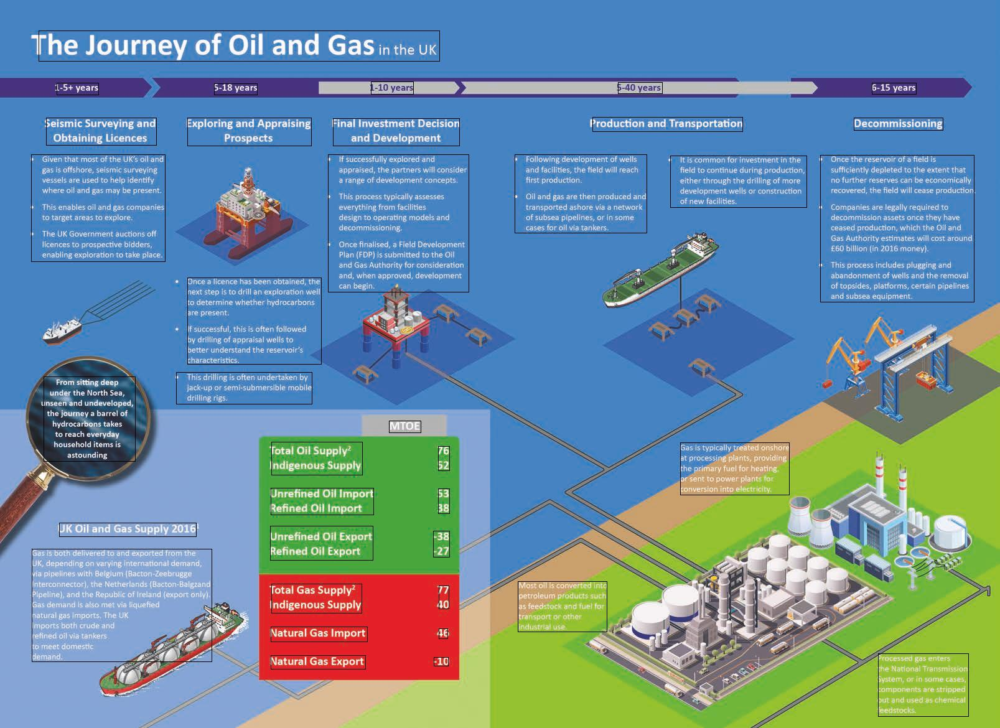

## Example - Complex infographic



## Context

The above image is simple, it contains blocks of Text and countries references well separated. 

You will see that some OCR engines will clearly expose their line processing while other would do a better raw output. 

Let's dive in each OCR Engine showing you how BBOXHelper helps increasing the coherence of the textual output. 

## Azure 



### Azure Raw Text ouput
```
Fossil evidence
AFRICA
of the Triassic
land reptile
INDIA
Lystrosaurus.
SOUTH AMERICA
AUSTRALIA
ANTARCTICA
Fossil remains of
Cynognathus, a
Fossils of the fern
Triassic land reptile
Glossopteris found
approximately
Fossil remains of the
in all of the southern
3 m long.
freshwater reptile
continents, show that
Mesosaurus
they were once joined.
```
We can clearly see that the lines of text are processed in a certain order in Azure Computer Vision adding the noise of the continents in between "sentences".

### After BBoxing... 


#### Azure text output
```
Fossil evidence of the Triassic land reptile Lystrosaurus.
AFRICA
INDIA
SOUTH AMERICA
AUSTRALIA
ANTARCTICA
Fossil remains of
Cynognathus, a Triassic land reptile approximately 3 m long.
Fossils of the fern Glossopteris found in all of the southern continents, show that they were once joined.
Fossil remains of the freshwater reptile Mesosaurus
```


## Google 



### Google Raw Text output

```
The Journey of Oil and Gas in the UK
1-5+ years
5-18 years
1-10 years
5-40 years
6-15 years
Production and Transportation
Decommissioning
Seismic Surveying and
Obtaining Licences
Exploring and Appraising
Prospects
Final Investment Decision
and Development
• Given that most of the UK's oil and
gas is offshore, seismic surveying
vessels are used to help identify
where oil and gas may be present.
• This enables oil and gas companies
to target areas to explore.
• The UK Government auctions off
licences to prospective bidders,
enabling exploration to take place.
• It is common for investment in the
field to continue during production,
either through the drilling of more
development wells or construction
of new facilities.
• If successfully explored and
appraised, the partners will consider
a range of development concepts.
. This process typically assesses
everything from facilities
design to operating models and
decommissioning
• Once finalised, a Field Development
Plan (FDP) is submitted to the Oil
and Gas Authority for consideration
and, when approved, development
can begin
• Following development of wells
and facilities, the field will reach
first production
• Oil and gas are then produced and
transported ashore via a network
of subsea pipelines, or in some
cases for oil via tankers.
• Once the reservoir of a field is
sufficiently depleted to the extent that
no further reserves can be economically
recovered, the field will cease production
• Companies are legally required to
decommission assets once they have
ceased production, which the Oil and
Gas Authority estimates will cost around
£60 billion (in 2016 money).
• This process includes plugging and
abandonment of wells and the removal
of topsides, platforms, certain pipelines
and subsea equipment.
Once a licence has been obtained, the
next step is to drill an exploration well
to determine whether hydrocarbons
are present.
If successful, this is often followed
by drilling of appraisal wells to
better understand the reservoir's
characteristics
• This drilling is often undertaken by
jack-up or semi-submersible mobile
drilling rigs
From sitting deep
under the North Sea,
unseen and undeveloped,
the journey a barrel of
hydrocarbons takes
to reach everyday
household items is
astounding
MTOE
Total Oil Supply
Indigenous Supply
76
52
Gas is typically treated onshore
at processing plants, providing
the primary fuel for heating
or sent to power plants for
conversion into electricity
Unrefined Oil Import
Refined Oil Import
53
38
UK Oil and Gas Supply 2016
Unrefined Oil Export
Refined Oil Export
-38
-27
Gas is both delivered to and exported from the
UK, depending on varying international demand,
via pipelines with Belgium (Bacton-Zeebrugge
Interconnector), the Netherlands (Bacton-Baigzand
Pipeline), and the Republic of Ireland (export only).
Gas demand is also met via liquefied
natural gas Imports. The UK
Imports both crude and
refined oil via tankers
to meet domestic
demand
Total Gas Supply?
Indigenous Supply
77
40
Most oll is converted into
petroleum products such
as feedstock and fuel for
transport or other
industrial use
Natural Gas Import
46
Natural Gas Export
-10
Processed gas enters
The National Transmission
System, or in some cases,
components are stripped
out and used as chemical
feedstocks
```


### After BBoxing 



#### From Google output
```
The Journey of Oil and Gas in the UK
1-5+ years
5-18 years
1-10 years
Seismic Surveying and Obtaining Licences
Exploring and Appraising
Prospects
Final Investment Decision
and Development
• Given that most of the UK's oil and
gas is offshore, seismic surveying vessels are used to help identify
where oil and gas may be present. • This enables oil and gas companies
to target areas to explore. • The UK Government auctions off
licences to prospective bidders, enabling exploration to take place.
• If successfully explored and
appraised, the partners will consider
a range of development concepts. . This process typically assesses
everything from facilities design to operating models and
decommissioning • Once finalised, a Field Development
Plan (FDP) is submitted to the Oil and Gas Authority for consideration and, when approved, development can begin
Once a licence has been obtained, the next step is to drill an exploration well to determine whether hydrocarbons are present. If successful, this is often followed by drilling of appraisal wells to better understand the reservoir's characteristics
• This drilling is often undertaken by
jack-up or semi-submersible mobile drilling rigs
From sitting deep under the North Sea, unseen and undeveloped, the journey a barrel of hydrocarbons takes
to reach everyday household items is
astounding
MTOE
Total Oil Supply Indigenous Supply
76 52
Unrefined Oil Import Refined Oil Import
53 38
UK Oil and Gas Supply 2016
Unrefined Oil Export Refined Oil Export
-38 -27
Gas is both delivered to and exported from the UK, depending on varying international demand, via pipelines with Belgium (Bacton-Zeebrugge Interconnector), the Netherlands (Bacton-Baigzand Pipeline), and the Republic of Ireland (export only). Gas demand is also met via liquefied natural gas Imports. The UK Imports both crude and refined oil via tankers to meet domestic demand
Total Gas Supply? Indigenous Supply
77 40
Natural Gas Import
46
Natural Gas Export
-10
5-40 years
Production and Transportation
• It is common for investment in the
field to continue during production, either through the drilling of more development wells or construction of new facilities.
• Following development of wells
and facilities, the field will reach
first production • Oil and gas are then produced and
transported ashore via a network of subsea pipelines, or in some cases for oil via tankers.
Gas is typically treated onshore at processing plants, providing the primary fuel for heating or sent to power plants for conversion into electricity
Most oll is converted into petroleum products such as feedstock and fuel for transport or other industrial use
6-15 years
Decommissioning
• Once the reservoir of a field is
sufficiently depleted to the extent that no further reserves can be economically
recovered, the field will cease production • Companies are legally required to
decommission assets once they have ceased production, which the Oil and Gas Authority estimates will cost around
£60 billion (in 2016 money). • This process includes plugging and
abandonment of wells and the removal of topsides, platforms, certain pipelines and subsea equipment.
Processed gas enters The National Transmission System, or in some cases, components are stripped out and used as chemical feedstocks
```

## Conclusion

With this simple example we can see that both outputs are more aligned, while there is still some dependency on each OCR engine.  

