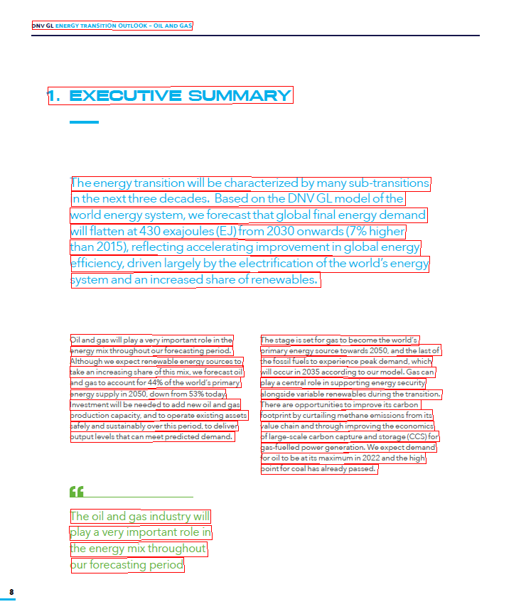
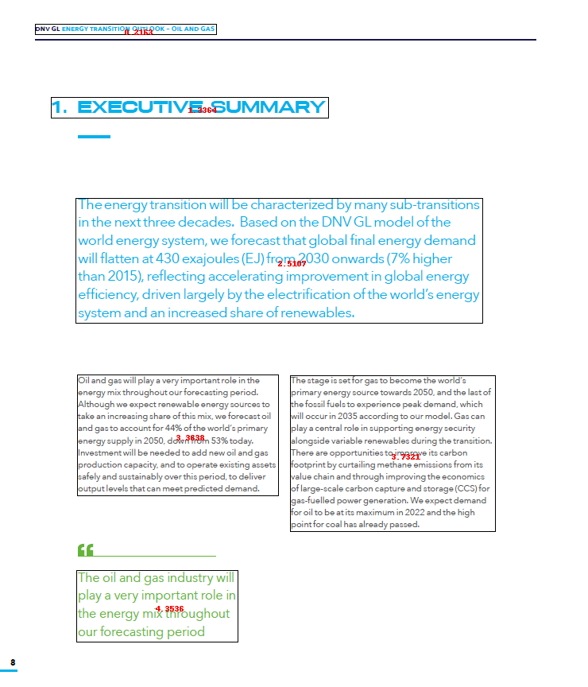
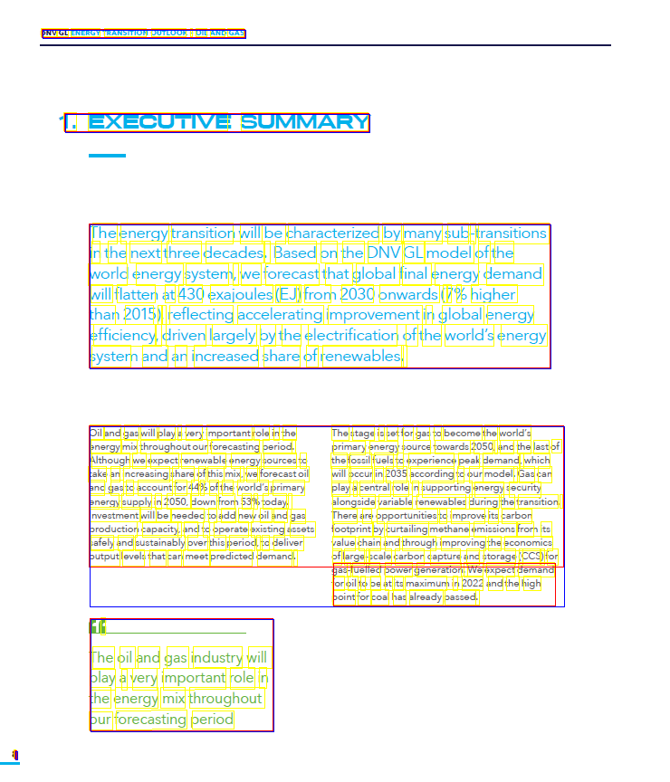
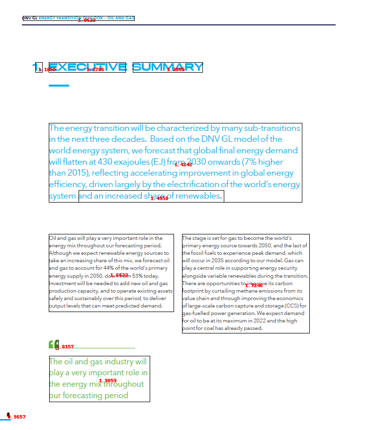
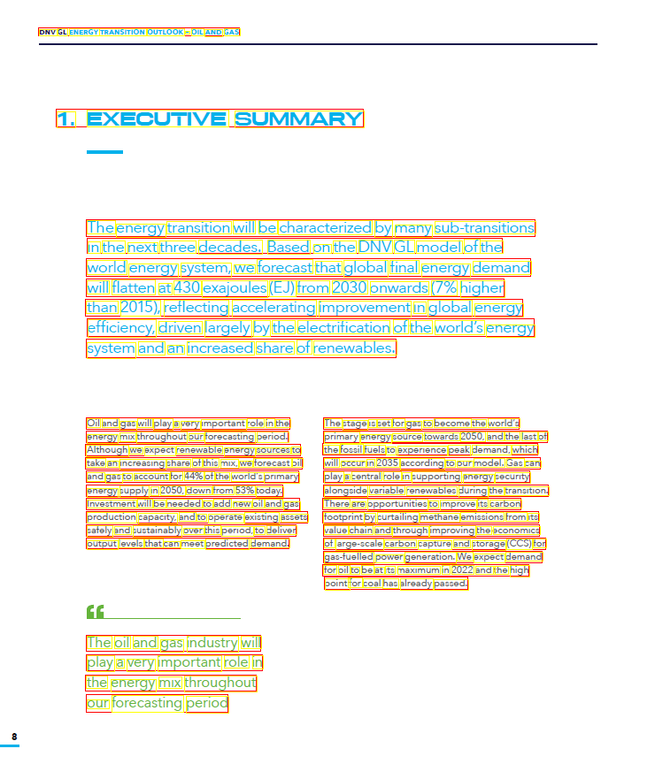
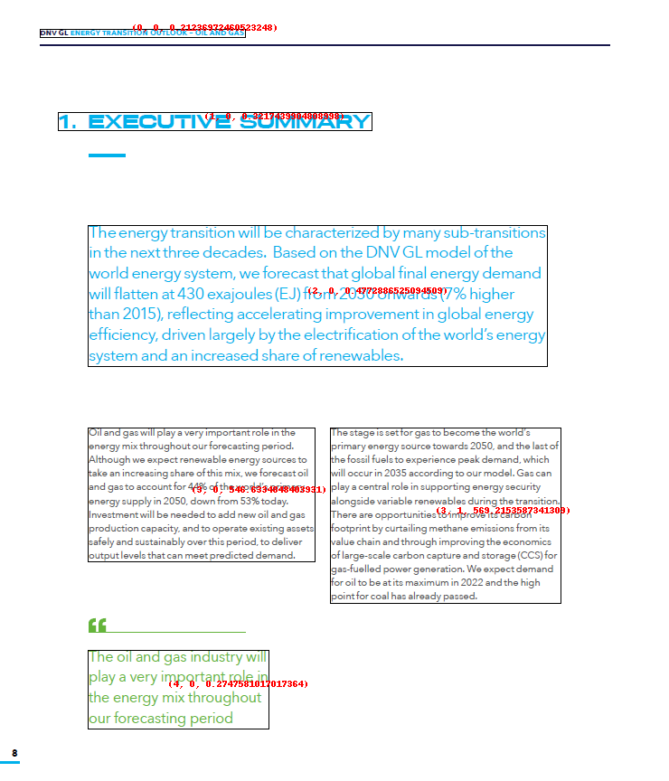

# Simple page layout


The above image is a simple scanned image from a PDF. 

You will see that some OCR engines will clearly expose their line processing while other would do a better raw output. 

Let's dive in each OCR Engine showing you how BBOXHelper helps increasing the coherence of the textual output. 
## Azure 
The below image represents the raw Azure OCR output where we drew each line of text bounding boxes. 


### Azure Raw Text output
The below output is not sorted in any just taken as-is from Azure Computer Vision response. 
```
DNV GL ENERGY TRANSITION OUTLOOK - OIL AND GAS
1. EXECUTIVE SUMMARY
The energy transition will be characterized by many sub-transitions
in the next three decades. Based on the DNV GL model of the
world energy system, we forecast that global final energy demand
will flatten at 430 exajoules (EJ) from 2030 onwards (7% higher
than 2015), reflecting accelerating improvement in global energy
efficiency, driven largely by the electrification of the world's energy
system and an increased share of renewables.
Oil and gas will play a very important role in the
The stage is set for gas to become the world's
energy mix throughout our forecasting period.
Although we expect renewable energy sources to
primary energy source towards 2050, and the last of
take an increasing share of this mix, we forecast oil
the fossil fuels to experience peak demand, which
and gas to account for 44% of the world's primary
will occur in 2035 according to our model. Gas can
play a central role in supporting energy security
energy supply in 2050, down from 53% today.
Investment will be needed to add new oil and gas
alongside variable renewables during the transition.
production capacity, and to operate existing assets
There are opportunities to improve its carbon
footprint by curtailing methane emissions from its
safely and sustainably over this period, to deliver
output levels that can meet predicted demand.
value chain and through improving the economics
of large-scale carbon capture and storage (CCS) for
gas-fuelled power generation. We expect demand
for oil to be at its maximum in 2022 and the high
point for coal has already passed.
The oil and gas industry will
play a very important role in
the energy mix throughout
our forecasting period
```

Key challenge here is the 2-column section where using the Raw output phrases aren't consistent with the actual visual. 

```
Oil and gas will play a very important role in the
The stage is set for gas to become the world's
```

So we need to have the 2-columns text clearly isolated from each other but sequential. You would read column One first then continue to read on column 2. 

### Azure BBoxing
Boxes are drawn on top of the original image. The numbers in red reprensent the blockid we use to sort the final boxes. See our [sorting](/sorting) section for more details. 

#### Azure BBoxing text output
```
DNV GL ENERGY TRANSITION OUTLOOK - OIL AND GAS
1. EXECUTIVE SUMMARY
The energy transition will be characterized by many sub-transitions in the next three decades. Based on the DNV GL model of the world energy system, we forecast that global final energy demand will flatten at 430 exajoules (EJ) from 2030 onwards (7% higher than 2015), reflecting accelerating improvement in global energy efficiency, driven largely by the electrification of the world's energy system and an increased share of renewables.
Oil and gas will play a very important role in the energy mix throughout our forecasting period. Although we expect renewable energy sources to take an increasing share of this mix, we forecast oil and gas to account for 44% of the world's primary energy supply in 2050, down from 53% today. Investment will be needed to add new oil and gas production capacity, and to operate existing assets safely and sustainably over this period, to deliver output levels that can meet predicted demand.
The stage is set for gas to become the world's primary energy source towards 2050, and the last of the fossil fuels to experience peak demand, which will occur in 2035 according to our model. Gas can play a central role in supporting energy security alongside variable renewables during the transition. There are opportunities to improve its carbon footprint by curtailing methane emissions from its value chain and through improving the economics of large-scale carbon capture and storage (CCS) for gas-fuelled power generation. We expect demand for oil to be at its maximum in 2022 and the high point for coal has already passed.
The oil and gas industry will play a very important role in the energy mix throughout our forecasting period
```

## Google 
The below image represents the raw Google OCR output where we drew each line of text bounding boxes. Yellow colored are the words, red is for paragraphs and blue are for the blocks. See [Google Ocr](/google) for more details.


### Google Raw text output (block level)
```
DNV GL ENERGY TRANSITION OUTLOOK - OIL AND GAS
1. EXECUTIVE SUMMARY
The energy transition will be characterized by many sub-transitions
in the next three decades. Based on the DNV GL model of the
world energy system, we forecast that global final energy demand
will flatten at 430 exajoules (EJ) from 2030 onwards (7% higher
than 2015), reflecting accelerating improvement in global energy
efficiency, driven largely by the electrification of the world's energy
system and an increased share of renewables.
Oil and gas will play a very important role in the The stage is set for gas to become the world's
energy mix throughoutour forecasting period. primary energy source towards 2050, and the last of
Although we expect renewable energy sources to the fossil fuels to experience peak demand, which
take an increasing share of this mix, we forecastoil will occur in 2035 according to our model. Gas can
and gas to account for 44% of the world's primary play a central role in supporting energy security
energy supply in 2050. down from 53% today. alongside variable renewables during the transition.
Investment will be needed to add new oil and gas There are opportunities to improve its carbon
production capacity, and to operate existing assets footprint by curtailing methane emissions from its
safely and sustainably over this period, to deliver value chain and through improving the economics
output levels that can meet predicted demand. of large-scale carbon capture and storage (CCS) for
gas-fuelled power generation. We expect demand
for oil to be at its maximum in 2022 and the high
point for coal has already passed.
6
The oil and gas industry will
play a very important role in
the energy mix throughout
our forecasting period
8
```

### Google BBoxing 
Boxes are drawn on the original image. The numbers in red reprensent the blockid we use to sort the final boxes. See our [sorting](/sorting) section for more details. 

#### Google BBoxing output
```
8
DNV GL ENERGY TRANSITION OUTLOOK - OIL AND GAS
1. EXECUTIVE SUMMARY
The energy transition will be characterized by many sub-transitions in the next three decades. Based on the DNV GL model of the world energy system, we forecast that global final energy demand will flatten at 430 exajoules (EJ) from 2030 onwards (7% higher than 2015), reflecting accelerating improvement in global energy efficiency, driven largely by the electrification of the world's energy system and an increased share of renewables.
Oil and gas will play a very important role in the  energy mix throughoutour forecasting period.  Although we expect renewable energy sources to  take an increasing share of this mix, we forecastoil  and gas to account for 44% of the world's primary  energy supply in 2050. down from 53% today.  Investment will be needed to add new oil and gas  production capacity, and to operate existing assets  safely and sustainably over this period, to deliver  output levels that can meet predicted demand. 
The stage is set for gas to become the world's primary energy source towards 2050, and the last of the fossil fuels to experience peak demand, which will occur in 2035 according to our model. Gas can play a central role in supporting energy security alongside variable renewables during the transition. There are opportunities to improve its carbon footprint by curtailing methane emissions from its value chain and through improving the economics of large-scale carbon capture and storage (CCS) for gas-fuelled power generation. We expect demand for oil to be at its maximum in 2022 and the high point for coal has already passed.
6
The oil and gas industry will play a very important role in the energy mix throughout our forecasting period
```

## AWS 
The below image represents the raw AWS Textextract output where we drew each line of text bounding boxes. Yellow colored are the words, red is for lines. See [AWS Ocr](/engines/aws) for more details.

### AWS Raw Text output 
```
DNV GL ENERGY TRANSITION OUTLOOK - OIL AND GAS
1. EXECUTIVE SUMMARY
The energy transition will be characterized by many sub-transitions
in the next three decades. Based on the DNV GL model of the
world energy system we forecast that global final energy demand
will flatten at 430 exajoules (EJ) from 2030 onwards (7% higher
than 2015), reflecting accelerating improvement in global energy
efficiency, driven largely by the electrification of the world's energy
system and an increased share of renewables.
Oil and gas will play a very important role in the
The stage is set for gas to become the world's
energy mix throughout our forecasting period.
primary energy source towards 2050, and the last of
Although we expect renewable energy sources to
the fossil fuels to experience peak demand, which
take an increasing share of this mix, we forecast oil
will occur in 2035 according to our model. Gas can
and gas to account for 44% of the world's primary
play a central role in supporting energy security
energy supply in 2050, down from 53% today.
alongside variable renewables during the transition.
Investment will be needed to add new oil and gas
There are opportunities to improve its carbon
production capacity. and to operate existing assets
footprint by curtailing methane emissions from its
safely and sustainably over this period, to deliver
value chain and through improving the economics
output levels that can meet predicted demand.
of large-scale carbon capture and storage (CCS) for
gas-fuelled power generation. We expect demand
for oil to be at its maximum in 2022 and the high
point for coal has already passed.
The oil and gas industry will
play a very important role in
the energy mix throughout
our forecasting period
```
### AWS BBoxing 
Boxes are drawn on the original image. The numbers in red reprensent the blockid we use to sort the final boxes. See our [sorting](/sorting) section for more details. 

#### AWS BBoxing text output
```
DNV GL ENERGY TRANSITION OUTLOOK - OIL AND GAS
1. EXECUTIVE SUMMARY
The energy transition will be characterized by many sub-transitions in the next three decades. Based on the DNV GL model of the world energy system we forecast that global final energy demand will flatten at 430 exajoules (EJ) from 2030 onwards (7% higher than 2015), reflecting accelerating improvement in global energy efficiency, driven largely by the electrification of the world's energy system and an increased share of renewables.
Oil and gas will play a very important role in the energy mix throughout our forecasting period. Although we expect renewable energy sources to take an increasing share of this mix, we forecast oil and gas to account for 44% of the world's primary energy supply in 2050, down from 53% today. Investment will be needed to add new oil and gas production capacity. and to operate existing assets safely and sustainably over this period, to deliver output levels that can meet predicted demand.
The stage is set for gas to become the world's primary energy source towards 2050, and the last of the fossil fuels to experience peak demand, which will occur in 2035 according to our model. Gas can play a central role in supporting energy security alongside variable renewables during the transition. There are opportunities to improve its carbon footprint by curtailing methane emissions from its value chain and through improving the economics of large-scale carbon capture and storage (CCS) for gas-fuelled power generation. We expect demand for oil to be at its maximum in 2022 and the high point for coal has already passed.
The oil and gas industry will play a very important role in the energy mix throughout our forecasting period
```

## Accessibility 

Being able to create audio from scanned article is one of my favorite application of ocrlayout. Combined with Translation service you have a powerfull tools to bring new data experience to your end-users or customers. 

Check the [audio file generated](/examples/audio/en_scan1.en-US.mp3) from the bboxed text 

## Conclusion

In this example we could see that BBoxHelper brought the concept of columns of text to get us better textual output. Besides key difference between the OCR engines, we now have a consistent output. 
