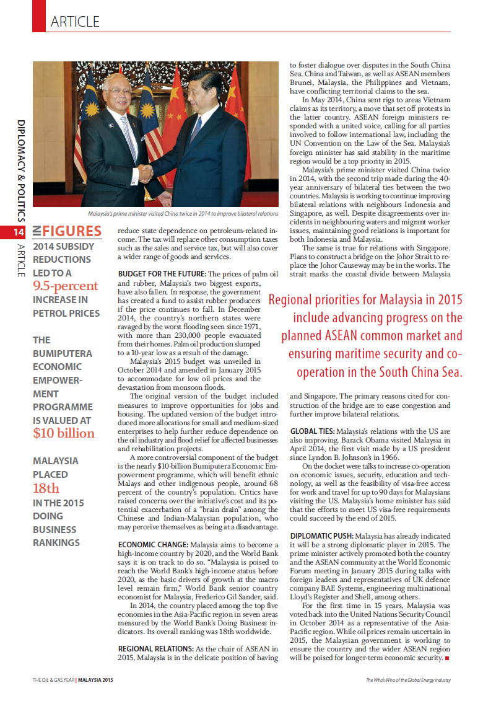
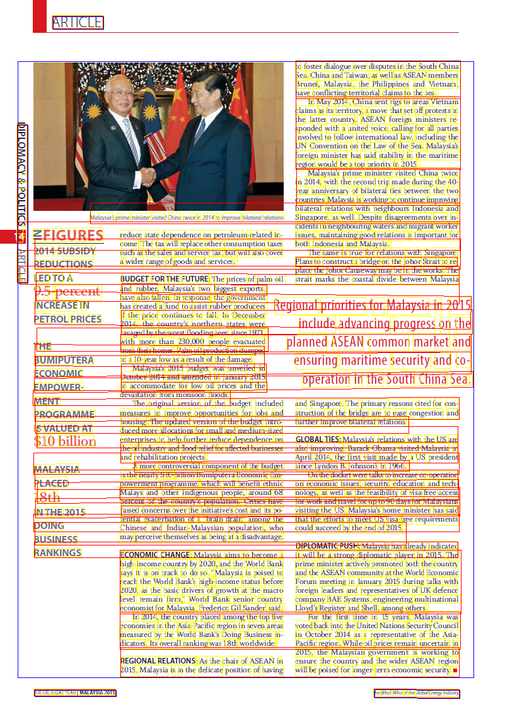
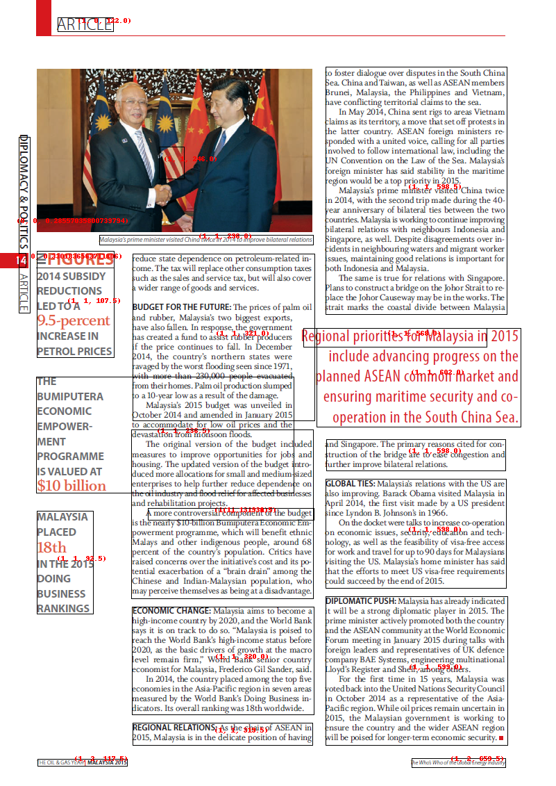

## Complex page Layout




## Context

The above image is simple, it contains blocks of Text and countries references well separated. 

You will see that some OCR engines will clearly expose their line processing while other would do a better raw output. 

Let's dive in each OCR Engine showing you how BBOXHelper helps increasing the coherence of the textual output. 

## Azure 


### Azure Raw Text ouput
```
Fossil evidence
AFRICA
of the Triassic
land reptile
INDIA
Lystrosaurus.
SOUTH AMERICA
AUSTRALIA
ANTARCTICA
Fossil remains of
Cynognathus, a
Fossils of the fern
Triassic land reptile
Glossopteris found
approximately
Fossil remains of the
in all of the southern
3 m long.
freshwater reptile
continents, show that
Mesosaurus
they were once joined.
```
We can clearly see that the lines of text are processed in a certain order in Azure Computer Vision adding the noise of the continents in between "sentences".

### After BBoxing... 


#### Azure text output
```
Fossil evidence of the Triassic land reptile Lystrosaurus.
AFRICA
INDIA
SOUTH AMERICA
AUSTRALIA
ANTARCTICA
Fossil remains of
Cynognathus, a Triassic land reptile approximately 3 m long.
Fossils of the fern Glossopteris found in all of the southern continents, show that they were once joined.
Fossil remains of the freshwater reptile Mesosaurus
```


## Google 



### Google Raw Text output
```
AFRICA
Ra
Fossil evidence
of the Triassic
l and reptile
Zystrosaurus
INDIA
SOUTH AMERICA
AUSTRALIA
ANTARCTICA
A
Fossil remains of
Cynognathus, a
Triassic land reptile
approximately
3 m long
Fossil remains of the
freshwater reptile
Mesosaurus
Fossils of the fern
Glossopteris found
in all of the southem
continents, show that
they were once joined
```
Google CV here does a better job in ordering the output text at first glance as it has the concept of blocks paragraphs. 

### After BBoxing 



#### From Google output
```
SOUTH AMERICA
A
Fossil remains of Cynognathus, a Triassic land reptile approximately 3 m long
AFRICA
Fossil remains of the freshwater reptile Mesosaurus
ANTARCTICA
INDIA
Ra
Fossils of the fern Glossopteris found in all of the southem continents, show that they were once joined
AUSTRALIA
Fossil evidence
of the Triassic l and reptile
Zystrosaurus
```
## Conclusion

With this simple example we can see that both outputs are more aligned, while there is still some dependency on each OCR engine.  

