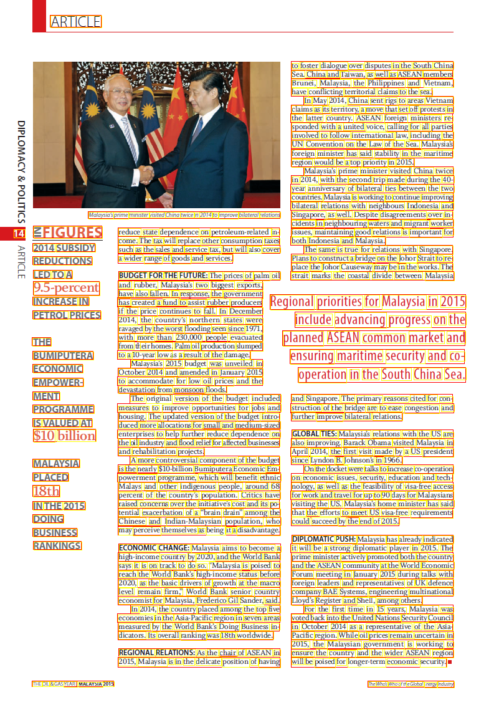
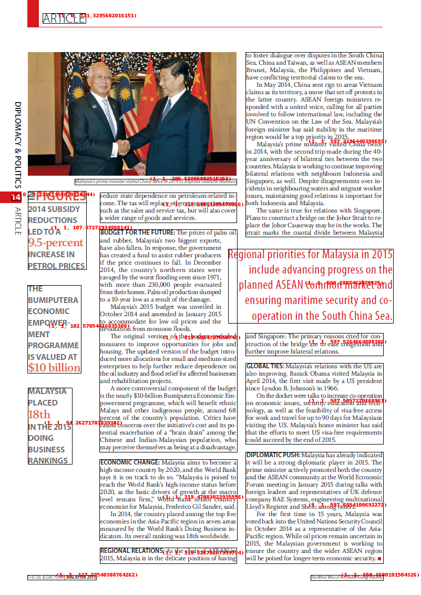

# Complex page Layout


The above image is more complex layout similar to newspapers. 

You will see that some OCR engines will clearly expose their line processing while other would do a better raw output. 

Let's dive in each OCR Engine showing you how BBOXHelper helps increasing the coherence of the textual output. 
## Azure 
The below image represents the raw Azure OCR output where we drew each line of text bounding boxes. 


### Azure Raw Text ouput
```
ARTICLE
to foster dialogue over disputes in the South China
Sea. China and Taiwan, as well as ASEAN members
Brunei, Malaysia, the Philippines and Vietnam,
have conflicting territorial claims to the sea.
In May 2014, China sent rigs to areas Vietnam
claims as its territory, a move that set off protests in
DIPLOMACY & POLITICS
the latter country. ASEAN foreign ministers re-
sponded with a united voice, calling for all parties
involved to follow intemational law, including the
UN Convention on the Law of the Sea. Malaysia's
foreign minister has said stability in the maritime
region would be a top priority in 2015.
Malaysia's prime minister visited China twice
in 2014, with the second trip made during the 40-
year anniversary of bilateral ties between the two
countries. Malaysia is working to continue improving
bilateral relations with neighbours Indonesia and
Malaysia's prime minister visited China twice in 2014 to improve bilateral relations
Singapore, as well. Despite disagreements over in-
ZFIGURES
reduce state dependence on petroleum-related in-
cidents in neighbouring waters and migrant worker
issues, maintaining good relations is important for
come. The tax will replace other consumption taxes
both Indonesia and Malaysia.
ARTICLE
2014 SUBSIDY
such as the sales and service tax, but will also cover
The same is true for relations with Singapore.
REDUCTIONS
a wider range of goods and services.
Plans to construct a bridge on the Johor Strait to re-
LED TO A
BUDGET FOR THE FUTURE: The prices of palm oil
place the Johor Causeway may be in the works. The
strait marks the coastal divide between Malaysia
9.5-percent
and rubber, Malaysia's two biggest exports,
INCREASE IN
have also fallen. In response, the government
PETROL PRICES
has created a fund to assist rubber producers Regional priorities for Malaysia in 2015
if the price continues to fall. In December
2014, the country's northern states were
ravaged by the worst flooding seen since 1971,
include advancing progress on the
THE
with more than 230,000 people evacuated
from their homes. Palm oil production slumped
planned ASEAN common market and
BUMIPUTERA
to a 10-year low as a result of the damage.
ECONOMIC
Malaysia's 2015 budget was unveiled in
ensuring maritime security and co-
EMPOWER-
October 2014 and amended in January 2015
to accommodate for low oil prices and the
operation in the South China Sea.
MENT
devastation from monsoon floods.
The original version of the budget included
and Singapore. The primary reasons cited for con-
PROGRAMME
measures to improve opportunities for jobs and
struction of the bridge are to ease congestion and
IS VALUED AT
housing. The updated version of the budget intro-
further improve bilateral relations.
$10 billion
duced more allocations for small and medium-sized
enterprises to help further reduce dependence on
GLOBAL TIES: Malaysia's relations with the US are
the oil industry and flood relief for affected businesses
also improving. Barack Obama visited Malaysia in
and rehabilitation projects.
MALAYSIA
A more controversial component of the budget
April 2014, the first visit made by a US president
is the nearly $10-billion Bumiputera Economic Em-
since Lyndon B. Johnson's in 1966.
PLACED
On the docket were talks to increase co-operation
powerment programme, which will benefit ethnic
on economic issues, security, education and tech-
18th
Malays and other indigenous people, around 68
percent of the country's population. Critics have
nology, as well as the feasibility of visa-free access
for work and travel for up to 90 days for Malaysians
IN THE 2015
raised concerns over the initiative's cost and its po-
visiting the US. Malaysia's home minister has said
DOING
tential exacerbation of a "brain drain" among the
Chinese and Indian-Malaysian population, who
that the efforts to meet US visa-free requirements
may perceive themselves as being at a disadvantage.
could succeed by the end of 2015.
BUSINESS
RANKINGS
DIPLOMATIC PUSH: Malaysia has already indicated
ECONOMIC CHANGE: Malaysia aims to become a
high-income country by 2020, and the World Bank
it will be a strong diplomatic player in 2015. The
prime minister actively promoted both the country
says it is on track to do so. "Malaysia is poised to
reach the World Bank's high-income status before
and the ASEAN community at the World Economic
Forum meeting in January 2015 during talks with
2020, as the basic drivers of growth at the macro
level remain firm," World Bank senior country
foreign leaders and representatives of UK defence
economist for Malaysia, Frederico Gil Sander, said.
company BAE Systems, engineering multinational
In 2014, the country placed among the top five
Lloyd's Register and Shell, among others.
economies in the Asia-Pacific region in seven areas
For the first time in 15 years, Malaysia was
voted back into the United Nations Security Council
measured by the World Bank's Doing Business in-
in October 2014 as a representative of the Asia-
dicators. Its overall ranking was 18th worldwide.
Pacific region. While oil prices remain uncertain in
REGIONAL RELATIONS: As the chair of ASEAN in
2015, the Malaysian government is working to
ensure the country and the wider ASEAN region
2015, Malaysia is in the delicate position of having
will be poised for longer-term economic security.
THE OIL & GAS YEAR | MALAYSIA 2015
The Who's Who of the Global Energy Industry
```
We can clearly see that the lines of text are processed in a certain order in Azure Computer Vision adding the noise of the continents in between "sentences".

### Azure BBoxing
Boxes are drawn on top of the original image. 

The numbers in red reprensent the blockid we use to sort the final boxes. See our [sorting](/sorting) section for more details. 


#### Azure text output
```
ARTICLE
DIPLOMACY & POLITICS ZFIGURES 2014 SUBSIDY ARTICLE REDUCTIONS LED TO A 9.5-percent INCREASE IN PETROL PRICES
THE BUMIPUTERA ECONOMIC EMPOWER- MENT PROGRAMME IS VALUED AT $10 billion
MALAYSIA PLACED 18th IN THE 2015 DOING BUSINESS RANKINGS
Malaysia's prime minister visited China twice in 2014 to improve bilateral relations
reduce state dependence on petroleum-related in- come. The tax will replace other consumption taxes such as the sales and service tax, but will also cover a wider range of goods and services.
Malaysia's 2015 budget was unveiled in October 2014 and amended in January 2015 to accommodate for low oil prices and the devastation from monsoon floods.
The original version of the budget included measures to improve opportunities for jobs and housing. The updated version of the budget intro- duced more allocations for small and medium-sized enterprises to help further reduce dependence on the oil industry and flood relief for affected businesses and rehabilitation projects. A more controversial component of the budget is the nearly $10-billion Bumiputera Economic Em- powerment programme, which will benefit ethnic Malays and other indigenous people, around 68 percent of the country's population. Critics have raised concerns over the initiative's cost and its po- tential exacerbation of a "brain drain" among the Chinese and Indian-Malaysian population, who may perceive themselves as being at a disadvantage.
ECONOMIC CHANGE: Malaysia aims to become a high-income country by 2020, and the World Bank says it is on track to do so. "Malaysia is poised to reach the World Bank's high-income status before 2020, as the basic drivers of growth at the macro level remain firm," World Bank senior country economist for Malaysia, Frederico Gil Sander, said. In 2014, the country placed among the top five economies in the Asia-Pacific region in seven areas measured by the World Bank's Doing Business in- dicators. Its overall ranking was 18th worldwide.
REGIONAL RELATIONS: As the chair of ASEAN in 2015, Malaysia is in the delicate position of having
BUDGET FOR THE FUTURE: The prices of palm oil and rubber, Malaysia's two biggest exports, have also fallen. In response, the government has created a fund to assist rubber producers Regional priorities for Malaysia in 2015 if the price continues to fall. In December 2014, the country's northern states were ravaged by the worst flooding seen since 1971, with more than 230,000 people evacuated from their homes. Palm oil production slumped to a 10-year low as a result of the damage.
to foster dialogue over disputes in the South China Sea. China and Taiwan, as well as ASEAN members Brunei, Malaysia, the Philippines and Vietnam, have conflicting territorial claims to the sea. In May 2014, China sent rigs to areas Vietnam claims as its territory, a move that set off protests in the latter country. ASEAN foreign ministers re- sponded with a united voice, calling for all parties involved to follow intemational law, including the UN Convention on the Law of the Sea. Malaysia's foreign minister has said stability in the maritime region would be a top priority in 2015. Malaysia's prime minister visited China twice in 2014, with the second trip made during the 40- year anniversary of bilateral ties between the two countries. Malaysia is working to continue improving bilateral relations with neighbours Indonesia and Singapore, as well. Despite disagreements over in- cidents in neighbouring waters and migrant worker issues, maintaining good relations is important for both Indonesia and Malaysia. The same is true for relations with Singapore. Plans to construct a bridge on the Johor Strait to re- place the Johor Causeway may be in the works. The strait marks the coastal divide between Malaysia
include advancing progress on the planned ASEAN common market and ensuring maritime security and co- operation in the South China Sea.
and Singapore. The primary reasons cited for con- struction of the bridge are to ease congestion and further improve bilateral relations.
GLOBAL TIES: Malaysia's relations with the US are also improving. Barack Obama visited Malaysia in April 2014, the first visit made by a US president since Lyndon B. Johnson's in 1966. On the docket were talks to increase co-operation on economic issues, security, education and tech- nology, as well as the feasibility of visa-free access for work and travel for up to 90 days for Malaysians visiting the US. Malaysia's home minister has said that the efforts to meet US visa-free requirements could succeed by the end of 2015.
DIPLOMATIC PUSH: Malaysia has already indicated it will be a strong diplomatic player in 2015. The prime minister actively promoted both the country and the ASEAN community at the World Economic Forum meeting in January 2015 during talks with foreign leaders and representatives of UK defence company BAE Systems, engineering multinational Lloyd's Register and Shell, among others. For the first time in 15 years, Malaysia was voted back into the United Nations Security Council in October 2014 as a representative of the Asia- Pacific region. While oil prices remain uncertain in 2015, the Malaysian government is working to ensure the country and the wider ASEAN region will be poised for longer-term economic security.
THE OIL & GAS YEAR | MALAYSIA 2015
The Who's Who of the Global Energy Industry
```

## Google 
The below image represents the raw Google OCR output where we drew each line of text bounding boxes. Yellow colored are the words, red is for paragraphs and blue are for the blocks. See [Google Ocr](/google) for more details.


### Google Raw Text output
```
ARTICLE
1
DIPLOMACY & POLITICS E ARTICLE
to foster dialogue over disputes in the South China
Sea. China and Taiwan, as well as ASEAN members
Brunei, Malaysia, the Philippines and Vietnam,
have conflicting territorial daims to the sea.
In May 2014, China sent rigs to areas Vietnam
claims as its territory, a move that set off protests in
the latter country. ASEAN foreign ministers re
sponded with a united voice, calling for all parties
involved to follow intemational law, including the
UN Convention on the Law of the Sea, Malaysia's
foreign minister has said stability in the maritime
region would be a top priority in 2015.
Malaysia's prime minister visited China twice
in 2014, with the second trip made during the 40-
year anniversary of bilateral ties between the two
countries. Malaysia is working to continue improving
bilateral relations with neighbours Indonesia and
Malaysia's prime minister visited China twice in 2014 to improve bilateral relations Singapore, as well. Despite disagreements over in-
cidents in neighbouring waters and migrant worker
14 ZFIGURES reduce state dependence on petroleum-related in issues, maintaining good relations is important for
come. The tax will replace other consumption taxes
both Indonesia and Malaysia.
2014 SUBSIDY such as the sales and service tax, but will also cover The same is true for relations with Singapore.
REDUCTIONS a wider range of goods and services.
Plans to construct a bridge on the Johor Strait to re
place the Johor Causeway may be in the works. The
m LED TO A
BUDGET FOR THE FUTURE: The prices of palm oil strait marks the coastal divide between Malaysia
9.5-percent
and rubber, Malaysia's two biggest exports,
have also fallen. In response, the government
INCREASE IN has created a fund to assist rubber producers Regional priorities for Malaysia in 2015
PETROL PRICES
if the price continues to fall. In December
2014, the country's northern states were include advancing progress on the
ravaged by the worst flooding seen since 1971,
THE
with more than 230,000 people evacuated planned ASEAN common market and
from their homes. Palm oil production slumped
BUMIPUTERA to a 10-year low as a result of the damage.
ensuring maritime security and co-
ECONOMIC
Malaysia's 2015 budget was unveiled in
October 2014 and amended in January 2015
operation in the South China Sea.
EMPOWER-
to accommodate for low oil prices and the
devastation from monsoon floods.
MENT
The original version of the budget included and Singapore. The primary reasons cited for con-
PROGRAMME measures to improve opportunities for jobs and struction of the bridge are to ease congestion and
housing. The updated version of the budget intro further improve bilateral relations.
IS VALUED AT
duced more allocations for small and medium-sized
$10 billion enterprises to help further reduce dependence on GLOBAL TIES: Malaysia's relations with the US are
the oil industry and flood relief for affected businesses also improving, Barack Obama visited Malaysia in
and rehabilitation projects.
April 2014, the first visit made by a US president
MALAYSIA
A more controversial component of the budget since Lyndon B. Johnson's in 1966.
is the nearly $10-billion Bumiputera Economic Em On the docket were talks to increase co-operation
PLACED
powerment programme, which will benefit ethnic
on economic issues, security, education and tech-
18th
Malays and other indigenous people, around 68 nology, as well as the feasibility of visa-free access
percent of the country's population. Critics have for work and travel for up to 90 days for Malaysians
IN THE 2015
raised concerns over the initiative's cost and its po visiting the US. Malaysia's home minister has said
tential exacerbation of a "brain drain" among the that the efforts to meet US visa-free requirements
DOING
Chinese and Indian-Malaysian population, who could succeed by the end of 2015.
BUSINESS may perceive themselves as being at a disadvantage.
DIPLOMATIC PUSH: Malaysia has already indicated
RANKINGS
ECONOMIC CHANGE: Malaysia aims to become a it will be a strong diplomatic player in 2015. The
high-income country by 2020, and the World Bank prime minister actively promoted both the country
says it is on track to do so. "Malaysia is poised to and the ASEAN community at the World Economic
reach the World Bank's high-income status before Forum meeting in January 2015 during talks with
2020, as the basic drivers of growth at the macro foreign leaders and representatives of UK defence
level remain firm." World Bank senior country company BAE Systems, engineering multinational
economist for Malaysia, Frederico Gil Sander, said. Lloyd's Register and Shell, among others.
In 2014, the country placed among the top five For the first time in 15 years, Malaysia was
economies in the Asia-Pacific region in seven areas voted back into the United Nations Security Council
measured by the World Bank's Doing Business in in October 2014 as a representative of the Asia-
dicators. Its overall ranking was 18th worldwide. Pacific region. While oil prices remain uncertain in
2015, the Malaysian government is working to
REGIONAL RELATIONS: As the chair of ASEAN in ensure the country and the wider ASEAN region
2015, Malaysia is in the delicate position of having will be poised for longer-term economic security.
THE OIL & GAS YEAR MALAYSIA 2015
The Whos Who of the Global Energy Industry
```

### Google BBoxing 
Boxes are drawn on the original image. The numbers in red reprensent the blockid we use to sort the final boxes. See our [sorting](/sorting) section for more details. 

#### Google BBoxing text output
```
m  DIPLOMACY & POLITICS E ARTICLE
14 
ARTICLE
1
to foster dialogue over disputes in the South China Sea. China and Taiwan, as well as ASEAN members Brunei, Malaysia, the Philippines and Vietnam, have conflicting territorial daims to the sea. In May 2014, China sent rigs to areas Vietnam claims as its territory, a move that set off protests in the latter country. ASEAN foreign ministers re sponded with a united voice, calling for all parties involved to follow intemational law, including the UN Convention on the Law of the Sea, Malaysia's foreign minister has said stability in the maritime region would be a top priority in 2015. Malaysia's prime minister visited China twice
Malaysia's prime minister visited China twice in 2014 to improve bilateral relations 
in 2014, with the second trip made during the 40year anniversary of bilateral ties between the two countries. Malaysia is working to continue improving bilateral relations with neighbours Indonesia and Singapore, as well. Despite disagreements over incidents in neighbouring waters and migrant worker issues, maintaining good relations is important for both Indonesia and Malaysia. The same is true for relations with Singapore. Plans to construct a bridge on the Johor Strait to re place the Johor Causeway may be in the works. The strait marks the coastal divide between Malaysia
ZFIGURES  2014 SUBSIDY  REDUCTIONS  LED TO A 9.5-percent INCREASE IN  PETROL PRICES
reduce state dependence on petroleum-related in  come. The tax will replace other consumption taxes such as the sales and service tax, but will also cover  a wider range of goods and services. BUDGET FOR THE FUTURE: The prices of palm oil  and rubber, Malaysia's two biggest exports, have also fallen. In response, the government has created a fund to assist rubber producers  if the price continues to fall. In December 2014, the country's northern states were  ravaged by the worst flooding seen since 1971, with more than 230,000 people evacuated  from their homes. Palm oil production slumped to a 10-year low as a result of the damage.
THE BUMIPUTERA 
Regional priorities for Malaysia in 2015 include advancing progress on the planned ASEAN common market and
EMPOWER MENT
Malaysia's 2015 budget was unveiled in October 2014 and amended in January 2015 to accommodate for low oil prices and the devastation from monsoon floods.
ensuring maritime security and coECONOMIC operation in the South China Sea.
IS VALUED AT $10 billion 
and Singapore. The primary reasons cited for conPROGRAMME  struction of the bridge are to ease congestion and further improve bilateral relations.
MALAYSIA PLACED
A more controversial component of the budget 
The original version of the budget included  measures to improve opportunities for jobs and  housing. The updated version of the budget intro  duced more allocations for small and medium-sized enterprises to help further reduce dependence on  the oil industry and flood relief for affected businesses  and rehabilitation projects. is the nearly $10-billion Bumiputera Economic Em  powerment programme, which will benefit ethnic Malays and other indigenous people, around 68  percent of the country's population. Critics have  raised concerns over the initiative's cost and its po  tential exacerbation of a "brain drain" among the  Chinese and Indian-Malaysian population, who  may perceive themselves as being at a disadvantage.
GLOBAL TIES: Malaysia's relations with the US are also improving, Barack Obama visited Malaysia in April 2014, the first visit made by a US president since Lyndon B. Johnson's in 1966. On the docket were talks to increase co-operation on economic issues, security, education and tech18th nology, as well as the feasibility of visa-free access for work and travel for up to 90 days for Malaysians visiting the US. Malaysia's home minister has said that the efforts to meet US visa-free requirements could succeed by the end of 2015.
IN THE 2015 DOING BUSINESS  RANKINGS
ECONOMIC CHANGE: Malaysia aims to become a  high-income country by 2020, and the World Bank  says it is on track to do so. "Malaysia is poised to  reach the World Bank's high-income status before  2020, as the basic drivers of growth at the macro  level remain firm." World Bank senior country  economist for Malaysia, Frederico Gil Sander, said.  In 2014, the country placed among the top five  economies in the Asia-Pacific region in seven areas  measured by the World Bank's Doing Business in 
DIPLOMATIC PUSH: Malaysia has already indicated it will be a strong diplomatic player in 2015. The prime minister actively promoted both the country and the ASEAN community at the World Economic Forum meeting in January 2015 during talks with foreign leaders and representatives of UK defence company BAE Systems, engineering multinational Lloyd's Register and Shell, among others. For the first time in 15 years, Malaysia was voted back into the United Nations Security Council in October 2014 as a representative of the Asiadicators. Its overall ranking was 18th worldwide.  Pacific region. While oil prices remain uncertain in 2015, the Malaysian government is working to ensure the country and the wider ASEAN region will be poised for longer-term economic security.
REGIONAL RELATIONS: As the chair of ASEAN in  2015, Malaysia is in the delicate position of having 
THE OIL & GAS YEAR MALAYSIA 2015
The Whos Who of the Global Energy Industry
```

## AWS 
The below image represents the raw AWS Textextract output where we drew each line of text bounding boxes. Yellow colored are the words, red is for lines. See [AWS Ocr](/engines/aws) for more details.

### AWS Raw Text output 
```
ARTICLE
to foster dialogue over disputes in the South China
Sea. China and Taiwan, as well as ASEAN members
Brunei, Malaysia, the Philippines and Vietnam,
have conflicting territorial claims to the sea.
In May 2014, China sent rigs to areas Vietnam
claims as its territory, a move that set off protests in
the latter country. ASEAN foreign ministers re.
sponded with a united voice, calling for all parties
involved to follow intemational law, including the
UN Convention on the Law of the Sea. Malaysia's
foreign minister has said stability in the maritime
region would be a top priority in 2015.
Malaysia's prime minister visited China twice
in 2014, with the second trip made during the 40-
year anniversary of bilateral ties between the two
countries. Malaysia is working to continue improving
bilateral relations with neighbours Indonesia and
Malaysia's prime minister visited Ching twice in 2014 to improve bilateral relations
Singapore, as well. Despite disagreements over in-
cidents in neighbouring waters and migrant worker
14
ZFIGURES
reduce state dependence on petroleum-related in-
issues, maintaining good relations is important for
come. The tax will replace other consumption taxes
both Indonesia and Malaysia.
2014 SUBSIDY
such as the sales and service tax, but will also cover
The same is true for relations with Singapore.
REDUCTIONS
a wider range of goods and services.
Plans to construct a bridge on the Johor Strait to re
place the Johor Causeway may be in the works The
LED TO A
BUDGET FOR THE FUTURE: The prices of palm oil
strait marks the coastal divide between Malaysia
9.5-percent
and rubber, Malaysia's two biggest exports,
have also fallen. In response, the government
INCREASE IN
has created a fund to assist rubber producers
Regiona priorities for Malaysia in 2015
PETROL PRICES
if the price continues to fall. In December
2014, the country's northern states were
include advancing progress on the
ravaged by the worst flooding seen since 1971,
THE
with more than 230.000 people evacuated
planned ASEAN common market and
from eirhomes Palm oil production slumped
BUMIPUTERA
to a 10-year low a result of the damage.
ensuring maritime security and C0-
ECONOMIC
Malaysia's 2015 budget was unveiled in
October 2014 and amended in January 2015
to accommodate for low oil prices and the
operation in the South China Sea.
EMPOWER-
devastation from monsoon floods.
MENT
The original version of the budget included
and Singapore. The primary reasons cited for con-
PROGRAMME
measures to improve opportunities for jobs and
struction of the bridge are to ease congestion and
housing The updated version of the budget intro-
further improve bilateral relations.
IS VALUED AT
duced more allocations for small and medium-sized
$10 billion
enterprises to help further reduce dependence on
GLOBAL TIES: Malaysia's relations with the US are
the oil lindustry and flood relief for affected businesses
also improving, Barack Obama visited Malaysia in
and rehabilitation projects.
April 2014, the first visit made by a US president
MALAYSIA
A more controversial component of the budget
since Lyndon B. Johnson's in 1966.
is the nearly $10-billion Bumiputera Economic Em-
On the docket were talks to increase co-operation
PLACED
powerment programme, which will benefit ethnic
on economic issues, security, education and tech-
18th
Malays and other indigenous people, around 68
nology, as well as the feasibility of visa-free access
percent of the country's population. Critics have
for work and travel for up to 90 days for Malaysians
IN THE 2015
raised concerns over the initiative's cost and its po-
visiting the US. Malaysia's home minister has said
tential exacerbation of a "brain drain" among the
that the efforts to meet US visa-free requirements
DOING
Chinese and Indian-Malaysian population, who
could succeed by the end of 2015.
BUSINESS
may perceive themselves as being at a disadvantage.
DIPLOMATIC PUSH: Malaysia has already indicated
RANKINGS
ECONOMIC CHANGE: Malaysia aims to become a
it will be a strong diplomatic player in 2015. The
high-income country by 2020, and the World Bank
prime minister actively promoted both the country
says it is on track to do so. "Malaysia is poised to
and the ASEAN community at the World Economic
reach the Word Bank's high-income status before
Forum meeting in January 2015 during talks with
2020, as the basic drivers of growth at the macro
foreign leaders and representatives of UK defence
level remain firm." Word Bank senior country
company BAE Systems, engineering multinational
economist for Malaysia, Frederico Gil Sander said.
Lloyd's Register and Shell, among others
In 2014, the country placed among the top five
For the first time in 15 years, Malaysia was
economies in the Asia-Pacific region in seven areas
voted into the United Nations Security Council
measured by the Word Bank's Doing Business in-
in October 2014 as a representative of the Asia-
dicators Its overall ranking was 18th worldwide.
Pacific region. While oil prices remain uncertain in
2015, the Malaysian government is working to
REGIONAL RELATIONS: As the chair of ASEAN in
ensure the country and the wider ASEAN region
2015, Malaysia is in the delicate position of having
will be poised for longer-term economic security.
THE OIL & GAS YEARI MALAYSIA 2015
The Who Who e Global Energy industry
```
### AWS BBoxing 
Boxes are drawn on the original image. The numbers in red reprensent the blockid we use to sort the final boxes. See our [sorting](/sorting) section for more details. 

#### AWS BBoxing text output
```
14
ARTICLE
MALAYSIA PLACED 18th IN THE 2015 DOING BUSINESS RANKINGS
THE BUMIPUTERA ECONOMIC EMPOWERMENT PROGRAMME IS VALUED AT $10 billion
ZFIGURES 2014 SUBSIDY REDUCTIONS LED TO A 9.5-percent INCREASE IN PETROL PRICES
Malaysia's prime minister visited Ching twice in 2014 to improve bilateral relations reduce state dependence on petroleum-related income. The tax will replace other consumption taxes such as the sales and service tax, but will also cover a wider range of goods and services.
REGIONAL RELATIONS: As the chair of ASEAN in 2015, Malaysia is in the delicate position of having
ECONOMIC CHANGE: Malaysia aims to become a high-income country by 2020, and the World Bank says it is on track to do so. "Malaysia is poised to reach the Word Bank's high-income status before 2020, as the basic drivers of growth at the macro level remain firm." Word Bank senior country economist for Malaysia, Frederico Gil Sander said. In 2014, the country placed among the top five economies in the Asia-Pacific region in seven areas measured by the Word Bank's Doing Business indicators Its overall ranking was 18th worldwide.
BUDGET FOR THE FUTURE: The prices of palm oil and rubber, Malaysia's two biggest exports, have also fallen. In response, the government has created a fund to assist rubber producers if the price continues to fall. In December 2014, the country's northern states were ravaged by the worst flooding seen since 1971, with more than 230.000 people evacuated from eirhomes Palm oil production slumped to a 10-year low a result of the damage. Malaysia's 2015 budget was unveiled in October 2014 and amended in January 2015 to accommodate for low oil prices and the devastation from monsoon floods. The original version of the budget included measures to improve opportunities for jobs and housing The updated version of the budget introduced more allocations for small and medium-sized enterprises to help further reduce dependence on the oil lindustry and flood relief for affected businesses and rehabilitation projects. A more controversial component of the budget is the nearly $10-billion Bumiputera Economic Empowerment programme, which will benefit ethnic Malays and other indigenous people, around 68 percent of the country's population. Critics have raised concerns over the initiative's cost and its potential exacerbation of a "brain drain" among the Chinese and Indian-Malaysian population, who may perceive themselves as being at a disadvantage.
Regiona priorities for Malaysia in 2015 include advancing progress on the planned ASEAN common market and ensuring maritime security and C0operation in the South China Sea.
to foster dialogue over disputes in the South China Sea. China and Taiwan, as well as ASEAN members Brunei, Malaysia, the Philippines and Vietnam, have conflicting territorial claims to the sea. In May 2014, China sent rigs to areas Vietnam claims as its territory, a move that set off protests in the latter country. ASEAN foreign ministers re. sponded with a united voice, calling for all parties involved to follow intemational law, including the UN Convention on the Law of the Sea. Malaysia's foreign minister has said stability in the maritime region would be a top priority in 2015. Malaysia's prime minister visited China twice in 2014, with the second trip made during the 40year anniversary of bilateral ties between the two countries. Malaysia is working to continue improving bilateral relations with neighbours Indonesia and Singapore, as well. Despite disagreements over incidents in neighbouring waters and migrant worker issues, maintaining good relations is important for both Indonesia and Malaysia. The same is true for relations with Singapore. Plans to construct a bridge on the Johor Strait to re place the Johor Causeway may be in the works The strait marks the coastal divide between Malaysia
GLOBAL TIES: Malaysia's relations with the US are also improving, Barack Obama visited Malaysia in April 2014, the first visit made by a US president since Lyndon B. Johnson's in 1966. On the docket were talks to increase co-operation on economic issues, security, education and technology, as well as the feasibility of visa-free access for work and travel for up to 90 days for Malaysians visiting the US. Malaysia's home minister has said that the efforts to meet US visa-free requirements could succeed by the end of 2015.
and Singapore. The primary reasons cited for construction of the bridge are to ease congestion and further improve bilateral relations.
DIPLOMATIC PUSH: Malaysia has already indicated it will be a strong diplomatic player in 2015. The prime minister actively promoted both the country and the ASEAN community at the World Economic Forum meeting in January 2015 during talks with foreign leaders and representatives of UK defence company BAE Systems, engineering multinational Lloyd's Register and Shell, among others For the first time in 15 years, Malaysia was voted into the United Nations Security Council in October 2014 as a representative of the AsiaPacific region. While oil prices remain uncertain in 2015, the Malaysian government is working to ensure the country and the wider ASEAN region will be poised for longer-term economic security.
THE OIL & GAS YEARI MALAYSIA 2015
The Who Who e Global Energy industry
```

## Accessibility 

Being able to create audio from scanned article is one of my favorite application of ocrlayout. Combined with Translation service you have a powerfull tools to bring new data experience to your end-users or customers. 

Check the [audio file generated](/examples/audio/en_scan2.en-US.mp3) from the bboxed text 

## Conclusion

Some noise to tackle in future versions, but overall we increased the comprehension of the image. 
