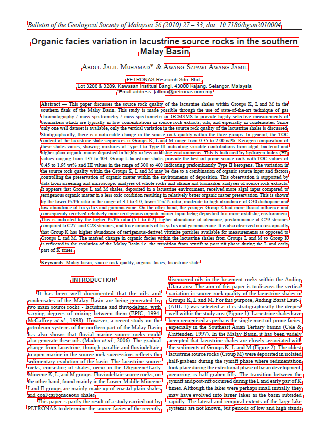
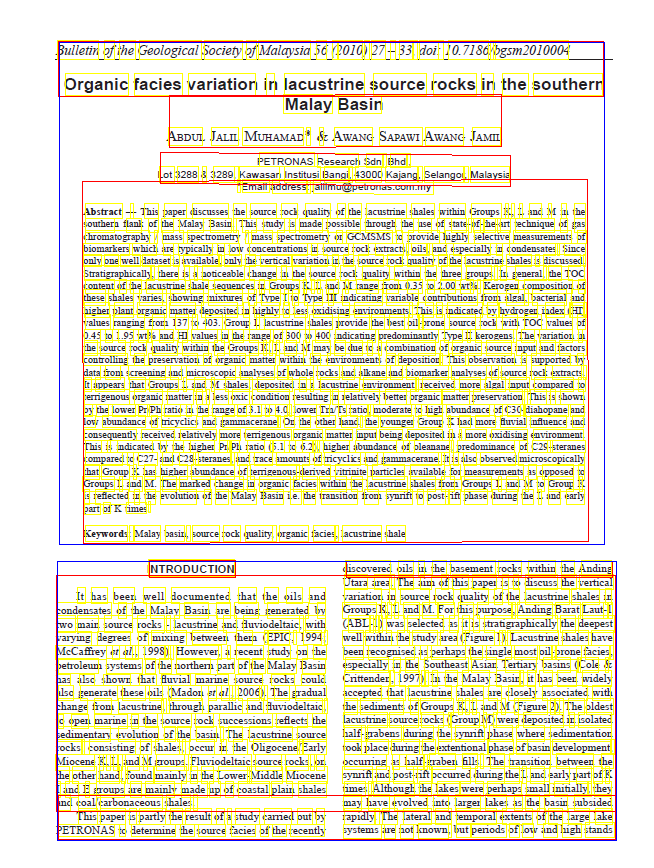
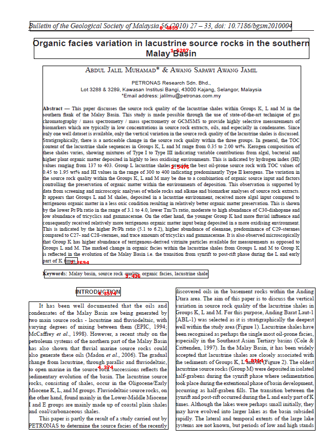

## Medium complexity page layout


The above image has multiple layouts with more condensed text. 

You will see that some OCR engines will clearly expose their line processing while other would do a better raw output. 

Let's dive in each OCR Engine showing you how BBOXHelper helps increasing the coherence of the textual output. 

## Azure 
The below image represents the raw Azure OCR output where we drew each line of text bounding boxes.


### Azure Raw Text ouput
The below output is not sorted in any just taken as-is from Azure Computer Vision response. 
```
Bulletin of the Geological Society of Malaysia 56 (2010) 27 - 33, doi: 10.7186/bgsm2010004
Organic facies variation in lacustrine source rocks in the southern
Malay Basin
ABDUL JALIL MUHAMAD* & AWANG SAPAWI AWANG JAMIL
PETRONAS Research Sdn. Bhd..
Lot 3288 & 3289, Kawasan Institusi Bangi, 43000 Kajang, Selangor, Malaysia
"Email address: jalilmu@petronas.com.my
Abstract - This paper discusses the source rock quality of the lacustrine shales within Groups K, L and M in the
southern flank of the Malay Basin. This study is made possible through the use of state-of-the-art technique of gas
chromatography / mass spectrometry / mass spectrometry or GCMSMS to provide highly selective measurements of
biomarkers which are typically in low concentrations in source rock extracts, oils, and especially in condensates. Since
only one well dataset is available, only the vertical variation in the source rock quality of the lacustrine shales is discussed.
Stratigraphically, there is a noticeable change in the source rock quality within the three groups. In general, the TOC
content of the lacustrine shale sequences in Groups K, L and M range from 0.35 to 2.00 wt%. Kerogen composition of
these shales varies, showing mixtures of Type I to Type III indicating variable contributions from algal, bacterial and
higher plant organic matter deposited in highly to less oxidising environments. This is indicated by hydrogen index (HI)
values ranging from 137 to 403. Group L lacustrine shales provide the best oil-prone source rock with TOC values of
0.45 to 1.95 wt% and HI values in the range of 300 to 400 indicating predominantly Type II kerogens. The variation in
the source rock quality within the Groups K, L and M may be due to a combination of organic source input and factors
controlling the preservation of organic matter within the environments of deposition. This observation is supported by
data from screening and microscopic analyses of whole rocks and alkane and biomarker analyses of source rock extracts.
It appears that Groups L and M shales, deposited in a lacustrine environment, received more algal input compared to
terrigenous organic matter in a less oxic condition resulting in relatively better organic matter preservation. This is shown
by the lower Pr/Ph ratio in the range of 3.1 to 4.0, lower Im/Ts ratio, moderate to high abundance of C30-diahopame and
low abundance of tricyclics and gammacerane. On the other hand, the younger Group K had more fluvial influence and
consequently received relatively more terrigenous organic matter input being deposited in a more oxidising environment.
This is indicated by the higher Pr/Ph ratio (5.1 to 6.2), higher abundance of oleanane, predominance of C:29-sterames
compared to C27- and C28-steranes, and trace amounts of tricyclics and gammacerame. It is also observed microscopically
that Group K has higher abundance of terrigenous-derived vitrinite particles available for measurements as opposed to
Groups L and M. The marked change in organic facies within the lacustrine shales from Groups L and M to Group K
part of K times.
is reflected in the evolution of the Malay Basin i.e. the transition from synrift to post-rift phase during the L and early
Keywords: Malay basin, source rock quality, organic facies, lacustrine shale
INTRODUCTION
discovered oils in the basement rocks within the Anding
Utara area. The aim of this paper is to discuss the vertical
It has been well documented that the oils and
variation in source rock quality of the lacustrine shales in
condensates of the Malay Basin are being generated by
two main source rocks - lacustrine and fluviodeltaic, with
Groups K, L and M. For this purpose, Anding Barat Laut-1
varying degrees of mixing between them (EPIC, 1994;
(ABL-1) was selected as it is stratigraphically the deepest
Mccaffrey et al., 1998). However, a recent study on the
well within the study area (Figure 1). Lacustrine shales have
petroleum systems of the northern part of the Malay Basin
been recognised as perhaps the single most oil-prone facies,
especially in the Southeast Asian Tertiary basins (Cole &
has also shown that fluvial marine source rocks could
Crittenden, 1997). In the Malay Basin, it has been widely
also generate these oils (Madon et al., 2006). The gradual
change from lacustrine, through parallic and fluviodeltaic,
accepted that lacustrine shales are closely associated with
to open marine in the source rock successions reflects the
the sediments of Groups K, L and M (Figure 2). The oldest
lacustrine source rocks (Group M) were deposited in isolated
sedimentary evolution of the basin. The lacustrine source
rocks, consisting of shales, occur in the Oligocene/Early
half-grabens during the synrift phase where sedimentation
Miocene K, L, and M groups. Fluviodeltaic source rocks, on
took place during the extentional phase of basin development,
the other hand, found mainly in the Lower-Middle Miocene
occuring as half-graben fills. The transition between the
synrift and post-rift occurred during the L and early part of K
I and E groups are mainly made up of coastal plain shales
and coal carbonaceous shales.
times. Although the lakes were perhaps small initially, they
This paper is partly the result of a study carried out by
may have evolved into larger lakes as the basin subsided
PETRONAS to determine the source facies of the recently
rapidly. The lateral and temporal extents of the large lake
systems are not known, but periods of low and high stands
```
We can clearly see that the lines of text are processed in a certain order in Azure Computer Vision adding the noise of the continents in between "sentences".

### Azure BBoxing... 

Boxes are drawn on top of the original image. 

The numbers in red reprensent the blockid we use to sort the final boxes. See our [sorting](/sorting) section for more details. 
#### Azure BBoxing text output
```
Bulletin of the Geological Society of Malaysia 56 (2010) 27 - 33, doi: 10.7186/bgsm2010004
Organic facies variation in lacustrine source rocks in the southern Malay Basin
ABDUL JALIL MUHAMAD* & AWANG SAPAWI AWANG JAMIL
PETRONAS Research Sdn. Bhd.. Lot 3288 & 3289, Kawasan Institusi Bangi, 43000 Kajang, Selangor, Malaysia "Email address: jalilmu@petronas.com.my
Abstract - This paper discusses the source rock quality of the lacustrine shales within Groups K, L and M in the southern flank of the Malay Basin. This study is made possible through the use of state-of-the-art technique of gas chromatography / mass spectrometry / mass spectrometry or GCMSMS to provide highly selective measurements of biomarkers which are typically in low concentrations in source rock extracts, oils, and especially in condensates. Since only one well dataset is available, only the vertical variation in the source rock quality of the lacustrine shales is discussed. Stratigraphically, there is a noticeable change in the source rock quality within the three groups. In general, the TOC content of the lacustrine shale sequences in Groups K, L and M range from 0.35 to 2.00 wt%. Kerogen composition of these shales varies, showing mixtures of Type I to Type III indicating variable contributions from algal, bacterial and higher plant organic matter deposited in highly to less oxidising environments. This is indicated by hydrogen index (HI) values ranging from 137 to 403. Group L lacustrine shales provide the best oil-prone source rock with TOC values of 0.45 to 1.95 wt% and HI values in the range of 300 to 400 indicating predominantly Type II kerogens. The variation in the source rock quality within the Groups K, L and M may be due to a combination of organic source input and factors controlling the preservation of organic matter within the environments of deposition. This observation is supported by data from screening and microscopic analyses of whole rocks and alkane and biomarker analyses of source rock extracts. It appears that Groups L and M shales, deposited in a lacustrine environment, received more algal input compared to terrigenous organic matter in a less oxic condition resulting in relatively better organic matter preservation. This is shown by the lower Pr/Ph ratio in the range of 3.1 to 4.0, lower Im/Ts ratio, moderate to high abundance of C30-diahopame and low abundance of tricyclics and gammacerane. On the other hand, the younger Group K had more fluvial influence and consequently received relatively more terrigenous organic matter input being deposited in a more oxidising environment. This is indicated by the higher Pr/Ph ratio (5.1 to 6.2), higher abundance of oleanane, predominance of C:29-sterames compared to C27- and C28-steranes, and trace amounts of tricyclics and gammacerame. It is also observed microscopically that Group K has higher abundance of terrigenous-derived vitrinite particles available for measurements as opposed to Groups L and M. The marked change in organic facies within the lacustrine shales from Groups L and M to Group K is reflected in the evolution of the Malay Basin i.e. the transition from synrift to post-rift phase during the L and early part of K times.
Keywords: Malay basin, source rock quality, organic facies, lacustrine shale
INTRODUCTION
It has been well documented that the oils and condensates of the Malay Basin are being generated by two main source rocks - lacustrine and fluviodeltaic, with varying degrees of mixing between them (EPIC, 1994; Mccaffrey et al., 1998). However, a recent study on the petroleum systems of the northern part of the Malay Basin has also shown that fluvial marine source rocks could also generate these oils (Madon et al., 2006). The gradual change from lacustrine, through parallic and fluviodeltaic, to open marine in the source rock successions reflects the sedimentary evolution of the basin. The lacustrine source rocks, consisting of shales, occur in the Oligocene/Early Miocene K, L, and M groups. Fluviodeltaic source rocks, on the other hand, found mainly in the Lower-Middle Miocene I and E groups are mainly made up of coastal plain shales and coal carbonaceous shales. This paper is partly the result of a study carried out by PETRONAS to determine the source facies of the recently
discovered oils in the basement rocks within the Anding Utara area. The aim of this paper is to discuss the vertical variation in source rock quality of the lacustrine shales in Groups K, L and M. For this purpose, Anding Barat Laut-1 (ABL-1) was selected as it is stratigraphically the deepest well within the study area (Figure 1). Lacustrine shales have been recognised as perhaps the single most oil-prone facies, especially in the Southeast Asian Tertiary basins (Cole & Crittenden, 1997). In the Malay Basin, it has been widely accepted that lacustrine shales are closely associated with the sediments of Groups K, L and M (Figure 2). The oldest lacustrine source rocks (Group M) were deposited in isolated half-grabens during the synrift phase where sedimentation took place during the extentional phase of basin development, occuring as half-graben fills. The transition between the synrift and post-rift occurred during the L and early part of K times. Although the lakes were perhaps small initially, they may have evolved into larger lakes as the basin subsided rapidly. The lateral and temporal extents of the large lake systems are not known, but periods of low and high stands
```

## Google 
The below image represents the raw Google OCR output where we drew each line of text bounding boxes. Yellow colored are the words, red is for paragraphs and blue are for the blocks. See [Google Ocr](/google) for more details.


### Google Raw Text output (block level)
```
Bulletin of the Geological Society of Malaysia 56 (2010) 27 – 33, doi: 10.7186/bgsm2010004
Organic facies variation in lacustrine source rocks in the southern
Malay Basin
ABDUL JALIL MUHAMAD* & AWANG SAPAWI AWANG JAMIL
PETRONAS Research Sdn. Bhd.
Lot 3288 & 3289, Kawasan Institusi Bangi, 43000 Kajang, Selangor, Malaysia
"Email address: jalilmu@petronas.com.my
Abstract — This paper discusses the source rock quality of the lacustrine shales within Groups K, L and M in the
souther flank of the Malay Basin. This study is made possible through the use of state-of-the-art technique of gas
chromatography / mass spectrometry / mass spectrometry or GCMSMS to provide highly selective measurements of
biomarkers which are typically in low concentrations in source rock extracts, oils, and especially in condensates. Since
only one well dataset is available, only the vertical variation in the source rock quality of the lacustrine shales is discussed.
Stratigraphically, there is a noticeable change in the source rock quality within the three groups. In general, the TOC
content of the lacustrine shale sequences in Groups K, L and M range from 0.35 to 2.00 wt%. Kerogen composition of
these shales varies, showing mixtures of Type I to Type II indicating variable contributions from algal, bacterial and
higher plant organic matter deposited in highly to less oxidising environments. This is indicated by hydrogen index (HI)
values ranging from 137 to 403. Group L lacustrine shales provide the best oil-prone source rock with TOC values of
0.45 to 1.95 wt% and HI values in the range of 300 to 400 indicating predominantly Type I kerogens. The variation in
the source rock quality within the Groups K, L and M may be due to a combination of organic source input and factors
controlling the preservation of organic matter within the environments of deposition. This observation is supported by
data from screening and microscopic analyses of whole rocks and alkane and biomarker analyses of source rock extracts.
It appears that Groups L and M shales, deposited in a lacustrine environment, received more algal input compared to
terrigenous organic matter in a less oxic condition resulting in relatively better organic matter preservation. This is shown
by the lower Pr/Ph ratio in the range of 3.1 to 4.0, lower Tm Ts ratio, moderate to high abundance of C30-diabopane and
low abundance of tricyclics and gammacerane. On the other hand, the younger Group K had more fluvial influence and
consequently received relatively more terrigenous organic matter input being deposited in a more oxidising environment
This is indicated by the higher Pr/Ph ratio (5.1 to 6.2), higher abundance of oleanane, predominance of C29-steranes
compared to C27- and C28-steranes, and trace amounts of tricyclics and gammacerane. It is also observed microscopically
that Group K has higher abundance of terrigenous-derived vitrinite particles available for measurements as opposed to
Groups L and M. The marked change in organic facies within the lacustrine shales from Groups L and M to Group K
is reflected in the evolution of the Malay Basin i.e. the transition from syurift to post-rift phase during the L and early
part of times.
Keywords: Malay basin, source rock quality, organic facies, lacustrine sbale
INTRODUCTION
discovered oils in the basement rocks within the Anding
Utara area. The aim of this paper is to discuss the vertical
It has been well documented that the oils and variation in source rock quality of the lacustrine shales in
condensates of the Malay Basin are being generated by Groups K, L and M. For this purpose. Anding Barat Laut-1
two main source rocks - lacustrine and fluviodeltaic, with ABL-1) was selected as it is stratigraphically the deepest
varying degrees of mixing between them (EPIC, 1994; well within the study area (Figure 1). Lacustrine shales have
McCaffrey et al., 1998). However, a recent study on the been recognised as perhaps the single most oil-prone facies,
petroleum systems of the northern part of the Malay Basin especially in the Southeast Asian Tertiary basins (Cole &
has also shown that fluvial marine source rocks could Crittenden, 1997). In the Malay Basin, it has been widely
also generate these oils (Madon et al., 2006). The gradual accepted that lacustrine shales are closely associated with
change from lacustrine, through parallic and fluviodeltaic, the sediments of Groups K, L and M (Figure 2). The oldest
to open marine in the source rock successions reflects the lacustrine source rocks (Group M) were deposited in isolated
sedimentary evolution of the basin. The lacustrine source half-grabens during the synrift phase where sedimentation
rocks, consisting of shales, occur in the Oligocene/Early took place during the extentional phase of basin development,
Miocene K, L, and M groups. Fluviodeltaic source rocks, on occurring as half-graben fills. The transition between the
the other hand, found mainly in the Lower-Middle Miocene synrift and post-rift occured during the L and early part of K
I and E groups are mainly made up of coastal plain shales times. Although the lakes were perhaps small initially, they
and coal/carbonaceous shales.
may have evolved into larger lakes as the basin subsided
This paper is partly the result of a study carried out by rapidly. The lateral and temporal extents of the large lake
PETRONAS to determine the source facies of the recently systems are not known, but periods of low and high stands
```

### Google BBoxing 
Boxes are drawn on the original image. The numbers in red reprensent the blockid we use to sort the final boxes. See our [sorting](/sorting) section for more details. 

#### Google BBoxing output
```
Bulletin of the Geological Society of Malaysia 56 (2010) 27 – 33, doi: 10.7186/bgsm2010004
Organic facies variation in lacustrine source rocks in the southern Malay Basin
times.
ABDUL JALIL MUHAMAD* & AWANG SAPAWI AWANG JAMIL PETRONAS Research Sdn. Bhd. Lot 3288 & 3289, Kawasan Institusi Bangi, 43000 Kajang, Selangor, Malaysia "Email address: jalilmu@petronas.com.my Abstract — This paper discusses the source rock quality of the lacustrine shales within Groups K, L and M in the souther flank of the Malay Basin. This study is made possible through the use of state-of-the-art technique of gas chromatography / mass spectrometry / mass spectrometry or GCMSMS to provide highly selective measurements of biomarkers which are typically in low concentrations in source rock extracts, oils, and especially in condensates. Since only one well dataset is available, only the vertical variation in the source rock quality of the lacustrine shales is discussed. Stratigraphically, there is a noticeable change in the source rock quality within the three groups. In general, the TOC content of the lacustrine shale sequences in Groups K, L and M range from 0.35 to 2.00 wt%. Kerogen composition of these shales varies, showing mixtures of Type I to Type II indicating variable contributions from algal, bacterial and higher plant organic matter deposited in highly to less oxidising environments. This is indicated by hydrogen index (HI) values ranging from 137 to 403. Group L lacustrine shales provide the best oil-prone source rock with TOC values of 0.45 to 1.95 wt% and HI values in the range of 300 to 400 indicating predominantly Type I kerogens. The variation in the source rock quality within the Groups K, L and M may be due to a combination of organic source input and factors controlling the preservation of organic matter within the environments of deposition. This observation is supported by data from screening and microscopic analyses of whole rocks and alkane and biomarker analyses of source rock extracts. It appears that Groups L and M shales, deposited in a lacustrine environment, received more algal input compared to terrigenous organic matter in a less oxic condition resulting in relatively better organic matter preservation. This is shown by the lower Pr/Ph ratio in the range of 3.1 to 4.0, lower Tm Ts ratio, moderate to high abundance of C30-diabopane and low abundance of tricyclics and gammacerane. On the other hand, the younger Group K had more fluvial influence and consequently received relatively more terrigenous organic matter input being deposited in a more oxidising environment This is indicated by the higher Pr/Ph ratio (5.1 to 6.2), higher abundance of oleanane, predominance of C29-steranes compared to C27- and C28-steranes, and trace amounts of tricyclics and gammacerane. It is also observed microscopically that Group K has higher abundance of terrigenous-derived vitrinite particles available for measurements as opposed to Groups L and M. The marked change in organic facies within the lacustrine shales from Groups L and M to Group K is reflected in the evolution of the Malay Basin i.e. the transition from syurift to post-rift phase during the L and early part of 
Keywords: Malay basin, source rock quality, organic facies, lacustrine sbale
INTRODUCTION
It has been well documented that the oils and  condensates of the Malay Basin are being generated by  two main source rocks - lacustrine and fluviodeltaic, with  varying degrees of mixing between them (EPIC, 1994;  McCaffrey et al., 1998). However, a recent study on the  petroleum systems of the northern part of the Malay Basin  has also shown that fluvial marine source rocks could  also generate these oils (Madon et al., 2006). The gradual  change from lacustrine, through parallic and fluviodeltaic,  to open marine in the source rock successions reflects the  sedimentary evolution of the basin. The lacustrine source  rocks, consisting of shales, occur in the Oligocene/Early  Miocene K, L, and M groups. Fluviodeltaic source rocks, on  the other hand, found mainly in the Lower-Middle Miocene  I and E groups are mainly made up of coastal plain shales  and coal/carbonaceous shales. This paper is partly the result of a study carried out by  PETRONAS to determine the source facies of the recently 
discovered oils in the basement rocks within the Anding Utara area. The aim of this paper is to discuss the vertical variation in source rock quality of the lacustrine shales in Groups K, L and M. For this purpose. Anding Barat Laut-1 ABL-1) was selected as it is stratigraphically the deepest well within the study area (Figure 1). Lacustrine shales have been recognised as perhaps the single most oil-prone facies, especially in the Southeast Asian Tertiary basins (Cole & Crittenden, 1997). In the Malay Basin, it has been widely accepted that lacustrine shales are closely associated with the sediments of Groups K, L and M (Figure 2). The oldest lacustrine source rocks (Group M) were deposited in isolated half-grabens during the synrift phase where sedimentation took place during the extentional phase of basin development, occurring as half-graben fills. The transition between the synrift and post-rift occured during the L and early part of K times. Although the lakes were perhaps small initially, they may have evolved into larger lakes as the basin subsided rapidly. The lateral and temporal extents of the large lake systems are not known, but periods of low and high stands
```
## Conclusion

We still have some noise to reduce neverthelss both outputs are aligned and consistent.

