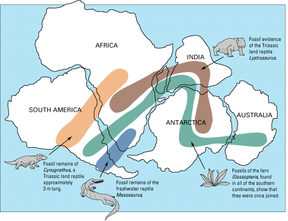

# OcrLayout Project

Provides the ability to get more meaninful text out of common OCR outputs. It manipulates the Bounding Boxes of lines or words. 

## Bounding Box Helper 

While OCR processing images containing lots of textual information, it might be relevant to assemble the generated text into meaninful single-line sentences or paragraphs.

### More meanifull output for what? 

With a closer-human-readable text...
-Text Analytics you may leverage any Text Analytics such as Key Phrases, Entities Extraction with more confidence of its outcome
-Accessibility : Any infographic becomes alive, overcoming the alt text feature.
-Modern browser Read Aloud feature : it becomes easier to build solutions to read aloud an image, increasing verbal narrative. 
-Machine Translation : get more accurate MT output. 
-Sentences/Paragraph Classification : from scanned-base images i.e. contracts, having a more meaninful textual output allows you to classify it at a granular level in terms of risk, personal clause or conditions. 

BBoxHelper has support for Azure/Google Computer Vision API.

Our goal here is not to conduct a comparison between Azure & Google Computer Vision API but to provide a consistent way to output OCR text for further processing  

## Example - Simple infographic



###Azure Raw Text ouput
```
Fossil evidence
AFRICA
of the Triassic
land reptile
INDIA
Lystrosaurus.
SOUTH AMERICA
AUSTRALIA
ANTARCTICA
Fossil remains of
Cynognathus, a
Fossils of the fern
Triassic land reptile
Glossopteris found
approximately
Fossil remains of the
in all of the southern
3 m long.
freshwater reptile
continents, show that
Mesosaurus
they were once joined.
```
We can clearly see that the lines of text are processed in a certain order in Azure Computer Vision adding the noise of the continents in between "sentences".

###Google Raw Text output
```
AFRICA
Ra
Fossil evidence
of the Triassic
l and reptile
Zystrosaurus
INDIA
SOUTH AMERICA
AUSTRALIA
ANTARCTICA
A
Fossil remains of
Cynognathus, a
Triassic land reptile
approximately
3 m long
Fossil remains of the
freshwater reptile
Mesosaurus
Fossils of the fern
Glossopteris found
in all of the southem
continents, show that
they were once joined
```
Google CV here does a better job in ordering the output text at first glance as it has the concept of blocks paragraphs. 

###After processing those 2 outputs with BBoxHelper you have 
From Azure input
```
Fossil evidence of the Triassic land reptile Lystrosaurus.
AFRICA
INDIA
SOUTH AMERICA
AUSTRALIA
ANTARCTICA
Fossil remains of
Cynognathus, a Triassic land reptile approximately 3 m long.
Fossils of the fern Glossopteris found in all of the southern continents, show that they were once joined.
Fossil remains of the freshwater reptile Mesosaurus
```
From Google output
```
SOUTH AMERICA
A
Fossil remains of Cynognathus, a Triassic land reptile approximately 3 m long
AFRICA
Fossil remains of the freshwater reptile Mesosaurus
ANTARCTICA
INDIA
Ra
Fossils of the fern Glossopteris found in all of the southem continents, show that they were once joined
AUSTRALIA
Fossil evidence
of the Triassic l and reptile
Zystrosaurus
```
We can see in this simple example that both outputs are more aligned. 


## Example - Complex infographic


## Example - Simple scanned page


Here BBoxHelper would help processing the Azure OCR response to create paragraphs of text instead of lines' array. Not too much magic here but rather a reformatting. 


## Example - Simple scanned page


Here BBoxHelper would help processing the Azure OCR response to create paragraphs of text instead of lines' array. Not too much magic here but rather a reformatting. 
